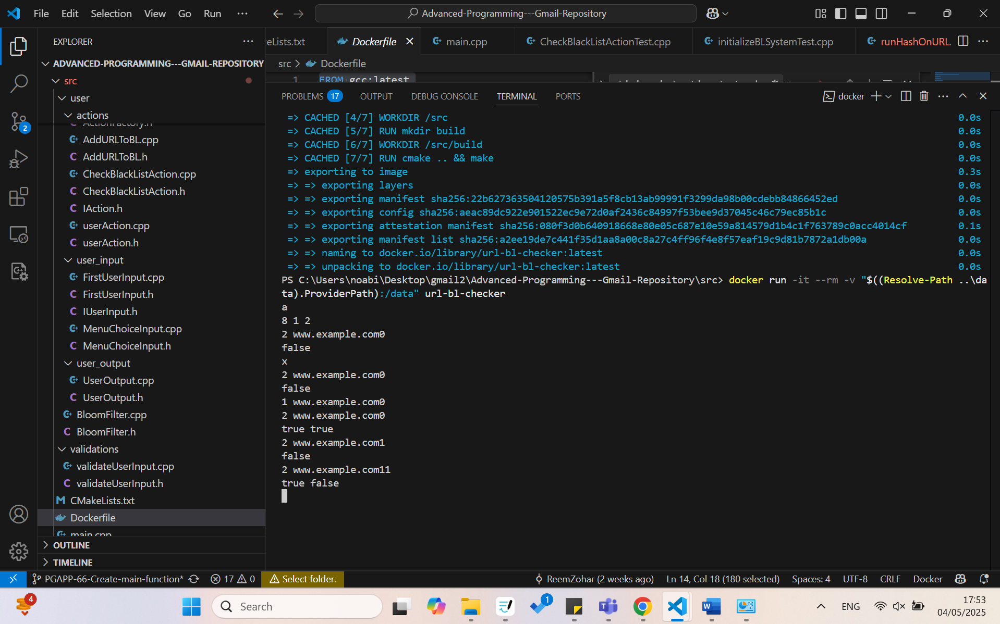
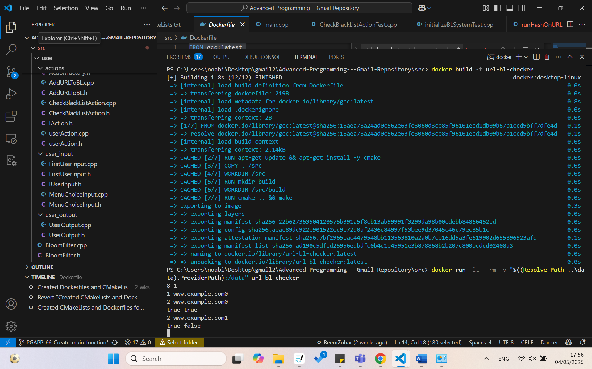
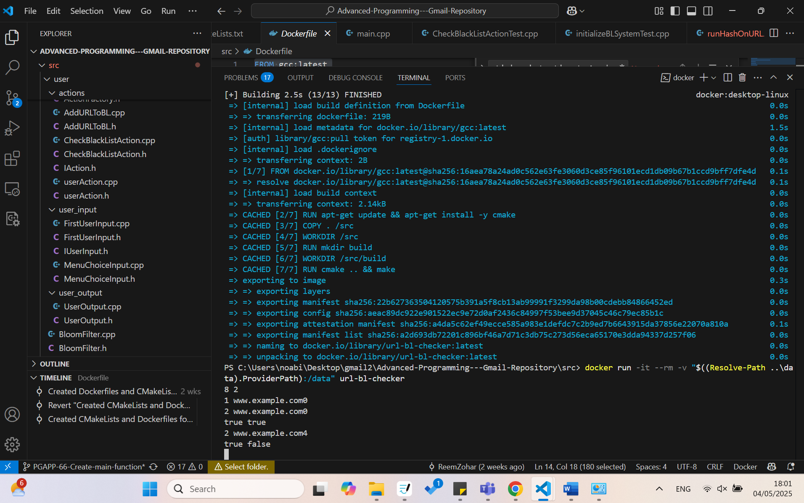
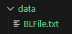
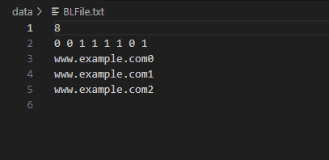
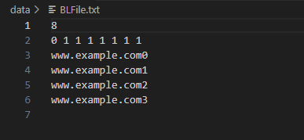
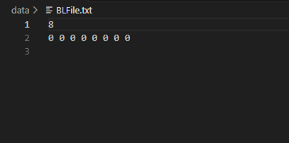

# Advanced-Programming---Gmail-Repository
 URL Blacklisting Hash System

## Introduction
This project implements a system that filters URLs using hash functions.  
It simulates a URL filtering mechanism using repeatable hashing to flag entries in a simulated blacklist bit array and a persistent blacklist file.
The primary use-case involves checking if a URL should be considered suspicious or blocked based on a configurable hashing strategy.

## Sprint Overview
This sprint delivered:
1. Core hashing logic (`HashRepeats`, `runHashOnURL`)
2. Simulated blacklist system with:
   - Bit array
   - Persistent file of blacklisted URLs
3. Full user interaction cycle:
   - Input
   - Validation
   - Hashing
   - Output
4. Create tests for verifying correctness across all components

## Screenshots
- UI prompt (User inputs for hash selection and repetitions)
- CLI test results

## Build & Run Instructions
Using Docker:
docker build -t url-bl-checker .
docker run -it --rm -v "$((Resolve-Path ..\\data).ProviderPath):/data" url-bl-checker

## Edge Cases: 
1.	Edge Case: Empty URL
    o	System handles it and wait for valid input.
2.	Edge Case: All repeat counts are zero
    o	No URL is filtered; output remains the initial state of the bit array.

## Blacklist File (BLFile)
1. The "BLFile.txt" file:
 
2. Location:
This file is located in the data folder and contains all the relevant information about the blacklist, allowing us to manage it during runtime and reload it at the start of a new program run.
3. Purpose:
Acts as a bloom-filter-like structure indicating whether a URL is Backlisted or not.
4. Structure:
The file contains 3 main things:
    1.	The size of the BlackList - at the top of the file
    2.	The BlackList bits array (array of bits separated with spaces) – on the 2nd line of the file
    3.	The Blacklisted URLs – from the 3rd line to the end of the file
5. For example:
  
We can see that the BlackList length is 8 (first line). In the second line, we have the 8-bit BlackList with bits 3, 4, 5, 6, and 8 turned on. There are three URLs that have been added to the Black List: www.example.com0, www.example.com1, and www.example.com2.
6. Handling during runtime:
 
Each time we add a new URL to the BlackList, the file is updated accordingly – the relevant bits are modified, the new Blacklisted URL is appended to the end of the file on a new Line.
For example, when the URL www.example.com23 was blacklisted:
•	Bits 2 and 7 were turned on.
•	The new URL was added to the end of the file.
7. Initialization:
When running the program for the first time, or if the file was deleted for some reason, the "BLFile.txt" file does not exist, so we create it. 
After the first user input, the file is created and contains the new blacklist length (as usual) and a blacklist initialized with zeros.
 For example:
  
The program has generated a new file named "BLFile.txt" with a 8-bits BlackList array initialized with zero.

## Main Data Structures
1. std::vector<bool> - Represents the blacklist as a bit array
2. std::function<size_t(size_t)> - Type used to represent hash functions.
3. HashRepeats Class - holds a hash function and a repeat count, allowing repeated application of the same hash.
4. std::vector<HashRepeats>	- A group of HashRepeats to process a URL using multiple hash functions.

## Key Components
1. IUserInput (interface) - Defines the contract for classes responsible for collecting user input.
2. firstUserInput, MenueChoiceInput Implement concrete user input logic (e.g., initial parameters, menu choices).
3. validateUserInput - Validates the input before proceeding to processing.
4. IAction Interface - for actions that should be executed after validation.
5. checkBlackListAction, userAction - Implementations of IAction that perform blacklist checking.
6. IUserOutput, userOutput - Responsible for displaying output and take the input from the user (eg., filtered results, error messages).
7. IHasher Interface - for creating custom hash logic, used in HashRepeats.

## File Structure Overview
Src/
├── Hash/
│   ├── hashrepeat.cpp
│   ├── HashRepeats.h
│   ├── IHasher.h
│   ├── runhashOnUrl.cpp
│   ├── runHashOnUrl.h
│
├── initialization/
│   ├── initializeBlsystem.cpp
│   ├── initializeBlsystem.h
│   ├── Iprogram.h
│   ├── program.cpp
│   ├── program.h
│
├── tests/
│   ├── ActionFactory.Test.cpp
│   ├── addUrlToBLTest.cpp
│   ├── checkBlackListActionTest.cpp
│   ├── initializeBLsystemTest.cpp
│   ├── runHashOnUrlTest.cpp
│   ├── userActionTest.cpp
│   ├── userOutputTest.cpp
│   ├── validateUserInputTest.cpp
│
├── user/
│   ├── actions/
│   │   ├── actionFactory.cpp
│   │   ├── actionFactory.h
│   │   ├── addURLToBL.cpp
│   │   ├── addURLToBL.h
│   │   ├── CheckBlackListAction.cpp
│   │   ├── CheckBlackListAction.h
│   │   ├── IAction.h
│   │   ├── userAction.cpp
│   │   ├── userAction.h
│   │
│   ├── userinput/
│   │   ├── firstUserInput.cpp
│   │   ├── firstUserInput.h
│   │   ├── IUserInput.h
│   │   ├── MenueChoiceInput.cpp
│   │   ├── MenueChoiceInput.h
│   │
│   ├── userOutput/
│   │   ├── userOutput.cpp
│   │   ├── userOutput.h
│
├── validations/
│   ├── validateUserInput.cpp
│   ├── validateUserInput.h
│
├── bloomFilter.cpp
├── bloomFilter.h
├── main.cpp
├── CMakeLists.txt
└── Dockerfile
