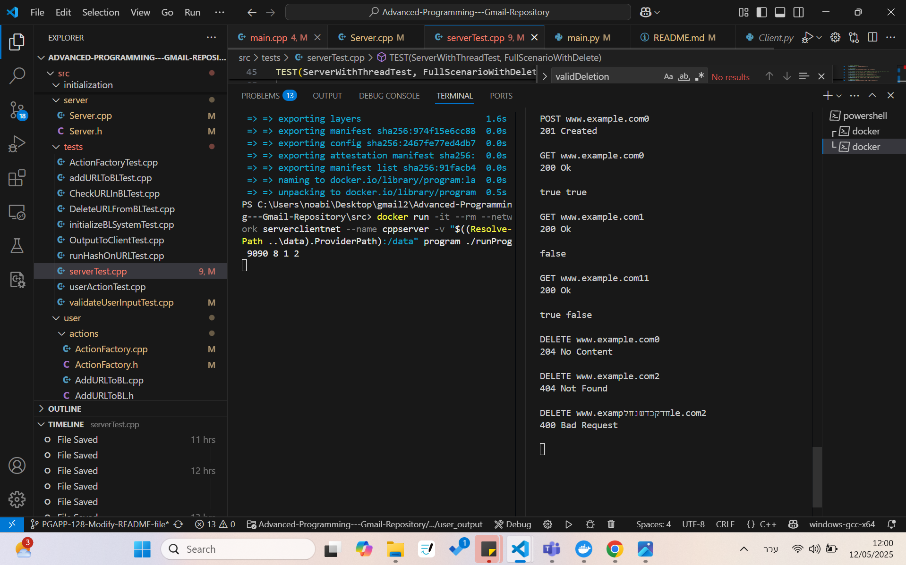
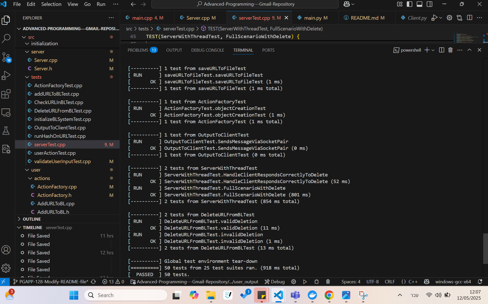

# Advanced-Programming---Gmail-Repository

## URL Blacklisting Hash System with Client-Server Architecture

### Introduction

This project implements a modular URL blacklisting system based on hash functions and an extendable architecture. 
The system filters URLs using repeatable hashing and a persistent blacklist file. In this sprint, the system was expanded to support:

* A new `DELETE` operation to remove URLs from the blacklist.
* A **TCP-based client-server architecture** for real-time interaction between a Python client and C++ server.

The design leverages interfaces (`IAction`, `IUserInput`, `IUserOutput`, `IHasher`, `Iclient`, `Iprogram`) to allow seamless feature addition with minimal changes.

---

### Sprint Overview

This sprint delivered:

1. Core hashing logic (`HashRepeats`, `runHashOnURL`).
2. Simulated blacklist system with:

   * Bit array (BloomFilter logic)
   * Persistent file of blacklisted URLs
3. Full user interaction cycle:

   * Input
   * Validation
   * Hashing
   * Output
4. TCP Client-Server communication
5. `DELETE` support for removing URLs
6. Extensive unit testing

---

### Client (Python)
1. explanation:
The Client connects to a server using TCP and allows message exchange.
It’s implemented using Python sockets and follows an interface (`IClient`) to ensure a consistent structure.
  * `Client.py`:
     * Establishes a connection to a server IP and port.
     *   Sends and receives messages over the socket.
     *   Uses UTF-8 encoding for communication.
2. files:
  * `IClient.py`:
     * Defines the interface (IClient) that every client must implement, including methods to start the connection, send/receive messages, and close the socket.
  * `main.py`:
     * Initializes a Client object with IP and port from command-line arguments.
     * Starts communication with the server.
     * Loops to read user input, sends it to the server, and prints the server's response.
This design makes the client modular and easy to extend or replace and the interface ensures any new implementation will be compatible with the existing structure.---

### Server (C++)
1. explanation:
  * Receives and handles commands via TCP socket from the client.
  * Delegates logic to `ActionFactory` using `IAction` classes (`AddURLToBL`, `CheckURLInBL`, `DeleteURLFromBL`).
  * Maintains the blacklist in-memory and on disk.

2. files:
  * `Server.cpp/h`: Socket handling, request loop
  * `BloomFilter.cpp/h`: Core blacklist logic
  * `ActionFactory.cpp/h`: Dispatches actions
> **Note:** This project uses IPv4.
---

### Input/Output Flow

1. Client starts and connects to server
2. User inputs a command (e.g., `POST <url>`)
3. Client sends command via TCP socket
4. Server validates, performs action, returns response
5. Client prints response to screen

---

### Supported Commands

1. `POST <url>` – Add URL to the blacklist (returns `201 Created`)

2. `GET <url>` – Check if URL is blacklisted (returns `200 Ok` followed by result)

3. `DELETE <url>` – Remove URL from the blacklist file only (returns `204 No Content` or `404 not found` if the URL never added to the black list)

> the server will return `400 Bad Request` – For invalid command formats or not valid URLs format.

---

### Build & Run Instructions

**Build C++ Server with Docker:**

```bash
docker network create serverclientnet
cd src
docker build -t program .
docker run -it --rm --network serverclientnet --name cppserver -v "$((Resolve-Path ..\data).ProviderPath):/data" program ./runProg <port> <bloom filter size> <hash>
```

#### For Example:
```bash
docker network create serverclientnet
cd src
docker build -t program .
docker run -it --rm --network serverclientnet --name cppserver -v "$((Resolve-Path ..\data).ProviderPath):/data" program ./runProg 9090 8 1 2
```

```bash
docker build -t pyclient src/client
# Run the client with target IP and port
docker run -it --rm --network serverclientnet pyclient cppserver 9090
```

*Example explanation:*  
 In this example, the server listens for connections on port **9090**, the Bloom filter will be initialized with a size of **8**, and the standard hash functions used are: **1** and **2**.
 The IP address refers to the server, and the port **9090** is used by the client to connect to it.


**Run Python Client:**

```bash
docker network create serverclientnet
docker build -t pyclient src/client
docker run -it --rm --network serverclientnet pyclient cppserver <port>
```


> **Note:** Please make sure to start the **server** before the **client**, so that the server is ready and listening for incoming requests.

---

### Edge Cases

1. **Empty URL input**: System waits for valid input.
2. **All repeat counts = 0**: BloomFilter bit array remains unchanged.
3. **Deleting a URL that does not exist**: System returns `404 Not Found`.

---

### Blacklist File (BLFile.txt)

* **Path**: `/data/BLFile.txt`

* **Structure**:

  1. First line: Size of the BloomFilter
  2. Second line: Bit array (space-separated)
  3. From line 3: List of blacklisted URLs

* **On POST**: Adds bits + appends URL

* **On DELETE**: Removes URL (and possibly bits if necessary)

---

### Main Data Structures

* `std::vector<bool>` – Blacklist bit array
* `std::function<size_t(string)>` – Hash function signature
* `std::vector<shared_ptr<IHasher>>` – Multiple hashers
* `BloomFilter` – Wraps blacklist logic, file sync

---

### Key Components

* `IUserInput`, `MenuChoiceInput`, `FirstUserInput`: Input wrappers
* `validateUserInput`: Input validation logic
* `IAction`, `AddURLToBL`, `CheckURLInBL`, `DeleteURLFromBL`: Action logic
* `IUserOutput`, `OutputToClient`: Output formatting + socket
* `IHasher`, `HashRepeats`: Reusable hash logic
* `IClient`: Interface for client communication, enabling pluggable implementations like a Python client or other future clients

---


## documentation:
1.  running examples:
   A.


  B.
  
The BLFile.txt: 


2. tests pass:


---

### Example of the Blacklist File

```
8
0 0 1 1 1 1 0 1
www.example.com0
www.example.com1
www.example.com2
```

---

### File Structure Overview

```
src/
├── client/                       # Python TCP client
│   ├── Client.py                 # Client socket logic
│   ├── IClient.py                # Interface for future clients
│   ├── main.py                   # Entrypoint script
│   └── dockerfile                # Dockerfile for Python client

├── hash/                         # Hash logic
│   ├── HashRepeats.cpp / .h
│   ├── IHasher.h
│   ├── runHashOnURL.cpp / .h

├── initialization/              # Startup system setup
│   ├── initializeBLSystem.cpp / .h
│   ├── Program.cpp / .h
│   └── IProgram.h

├── server/                      # C++ server
│   ├── Server.cpp / .h

├── user/                        # Input / Output / Actions
│   ├── actions/
│   │   ├── ActionFactory.cpp / .h
│   │   ├── AddURLToBL.cpp / .h
│   │   ├── CheckURLInBL.cpp / .h
│   │   ├── DeleteURLFromBL.cpp / .h
│   │   ├── IAction.h
│   │   └── userAction.cpp / .h
│   ├── user_input/
│   │   ├── FirstUserInput.cpp / .h
│   │   ├── MenuChoiceInput.cpp / .h
│   │   └── IUserInput.h
│   └── user_output/
│       ├── OutputToClient.cpp / .h
│       ├── UserOutput.cpp / .h
│       └── IUserOutput.h

├── validations/
│   ├── validateUserInput.cpp / .h

├── BloomFilter.cpp / .h         # BloomFilter logic
├── main.cpp                     # Server entrypoint
├── Dockerfile                   # Dockerfile for C++ server
├── CMakeLists.txt

├── tests/                       # GTest unit tests
│   ├── ActionFactoryTest.cpp
│   ├── addURLToBLTest.cpp
│   ├── CheckURLInBLTest.cpp
│   ├── DeleteURLFromBLTest.cpp
│   ├── initializeBLSystemTest.cpp
│   ├── OutputToClientTest.cpp
│   ├── runHashOnURLTest.cpp
│   ├── serverTest.cpp
│   ├── userActionTest.cpp
│   └── validateUserInputTest.cpp

└── README.md
```

---

### Technologies Used

* **C++17** – Core backend logic
* **Python 3.9** – Client logic
* **CMake** – Build system
* **Google Test** – Testing framework
* **Docker** – Containerized build/run
* **STL / Filesystem** – Efficient memory and file I/O

---

### Summary

This sprint showcases how a modular design enables easy extension. 
The new DELETE operation and client-server communication were added without rewriting core logic — thanks to clean interfaces and abstractions.
This architecture is testable, and open for future expansion (e.g., usind diffrent hash functions, adding clients, etc.).
